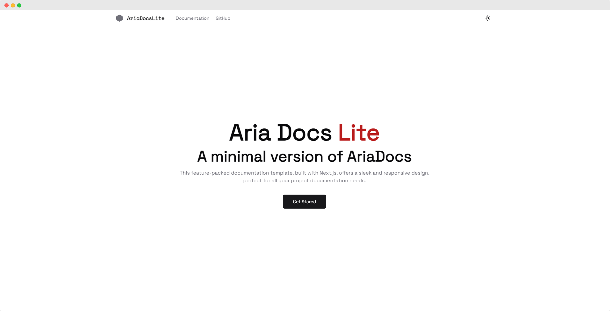
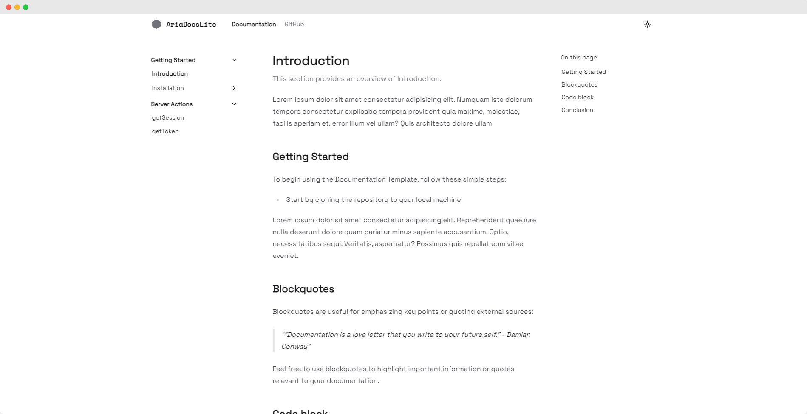

# 4Form CMS Documentation

Complete documentation for 4Form CMS - a powerful form builder and content management system that allows you to create, customize, and manage forms with ease.


## About 4Form CMS

4Form CMS is a comprehensive form builder and management platform that provides:

- **Form Builder**: Create custom forms with various field types
- **Response Management**: Collect, view, and export form submissions  
- **Email Notifications**: Set up automated email alerts for form submissions
- **SMTP Integration**: Configure custom email settings for your forms
- **HTML Integration**: Embed forms into any website or application
- **Admin Dashboard**: Comprehensive overview of all your forms and data

## Documentation Features

This documentation site is built with Next.js and includes:

```plaintext
Features
├── MDX supported
├── Nested pages support  
├── Syntax highlighting
├── Table of contents
├── Code line highlight & code title
├── Static site generation
├── Custom components
└── Light mode & dark mode
```

## Getting Started

First, run the development server:

```bash
npm run dev
# or
yarn dev
# or
pnpm dev
# or
bun dev
```

Open [http://localhost:3000](http://localhost:3000) with your browser to see the result.

You can start editing the documentation by modifying files in the `contents/docs/` directory. The pages auto-update as you edit the files.

## Project Structure

```
4form-cms-docs/
├── app/                    # Next.js app directory
├── components/             # React components
├── contents/docs/          # Documentation content (MDX files)
├── lib/                    # Utility functions and configurations
├── public/                 # Static assets
└── styles/                 # CSS styles
```

## Documentation Sections

- **Getting Started**: Introduction and admin dashboard overview
- **Forms**: Creating and managing forms
- **Integration**: Embedding forms into websites and applications  
- **Responses**: Viewing and managing form submissions
- **SMTP**: Configuring email settings
- **Notifications**: Setting up automated alerts
- **Server Actions**: API reference and server-side functions

## Contributing

To contribute to the documentation:

1. Fork the repository
2. Create a new branch for your changes
3. Edit the MDX files in `contents/docs/`
4. Test your changes locally
5. Submit a pull request

## Deploy on Vercel

The easiest way to deploy this documentation is to use the [Vercel Platform](https://vercel.com/new?utm_medium=default-template&filter=next.js&utm_source=create-next-app&utm_campaign=create-next-app-readme).

Check out the [Next.js deployment documentation](https://nextjs.org/docs/deployment) for more details.

## Learn More

To learn more about the technologies used:

- [Next.js Documentation](https://nextjs.org/docs) - learn about Next.js features and API
- [MDX Documentation](https://mdxjs.com/) - learn about MDX for content authoring
- [Tailwind CSS](https://tailwindcss.com/) - utility-first CSS framework


